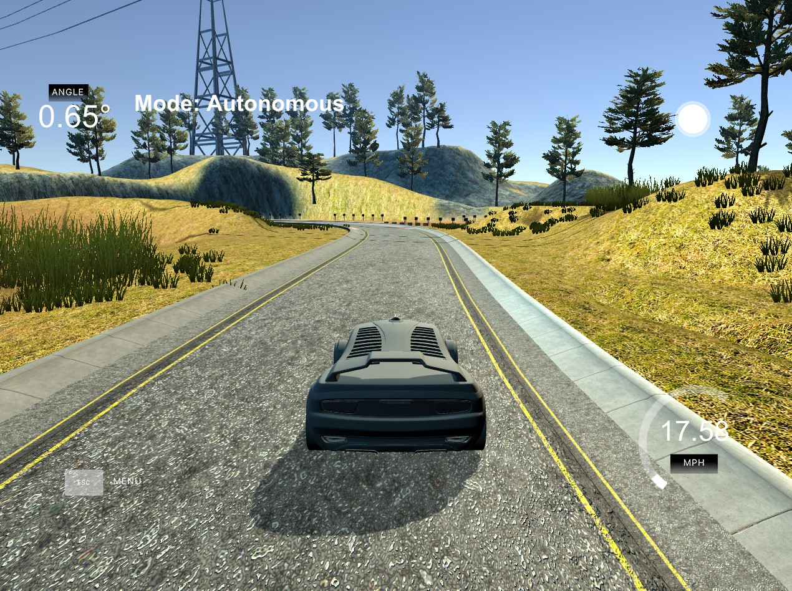

# CarND-Controls-PID
Self-Driving Car Engineer Nanodegree Program



---
## Observations

### P --> Proportional
- Proportional is taken in the sense as to be proportional to the direction of the track
- The error that we get from the proportionality is known as the crosstrack error (CTE)
- Higher values of this coefficient actually increase the oscilation of the car
- Lower values incrase the amount of time required for the car to adjust steering (terrible at turning)
- Found that the optimal value was 0.1 from trial and error
### I --> Integral
- Main intention is to help counter systematic bias (ex. misaligned wheels)
- Takes into account past integrals of CTE to help adjust angle
- Higher values overshoot
- It's generally recommended to only use integration only when needed, because my car worked perfectly as a PD controller, I left the value to be near 0 (0.0025)
- This is mainly because of the fact that if the value was 0, the car overshot and the tires sometimes hit the lane
### D --> Differential
- Takes CTE into consideration for steering in the direction of the lane
- If CTE is small, then the car will counter steer to ensure that there is no overshooting
- Higher values increase steepness of steering --> very abrupt
- Too low of a value might not be able to counter the overshooting in time causing it to go out of the track
- Chose 2.5 as the optimal value through trial and error

---
## Dependencies

* cmake >= 3.5
 * All OSes: [click here for installation instructions](https://cmake.org/install/)
* make >= 4.1(mac, linux), 3.81(Windows)
  * Linux: make is installed by default on most Linux distros
  * Mac: [install Xcode command line tools to get make](https://developer.apple.com/xcode/features/)
  * Windows: [Click here for installation instructions](http://gnuwin32.sourceforge.net/packages/make.htm)
* gcc/g++ >= 5.4
  * Linux: gcc / g++ is installed by default on most Linux distros
  * Mac: same deal as make - [install Xcode command line tools]((https://developer.apple.com/xcode/features/)
  * Windows: recommend using [MinGW](http://www.mingw.org/)
* [uWebSockets](https://github.com/uWebSockets/uWebSockets)
  * Run either `./install-mac.sh` or `./install-ubuntu.sh`.
  * If you install from source, checkout to commit `e94b6e1`, i.e.
    ```
    git clone https://github.com/uWebSockets/uWebSockets 
    cd uWebSockets
    git checkout e94b6e1
    ```
    Some function signatures have changed in v0.14.x. See [this PR](https://github.com/udacity/CarND-MPC-Project/pull/3) for more details.
* Simulator. You can download these from the [project intro page](https://github.com/udacity/self-driving-car-sim/releases) in the classroom.

Fellow students have put together a guide to Windows set-up for the project [here](https://s3-us-west-1.amazonaws.com/udacity-selfdrivingcar/files/Kidnapped_Vehicle_Windows_Setup.pdf) if the environment you have set up for the Sensor Fusion projects does not work for this project. There's also an experimental patch for windows in this [PR](https://github.com/udacity/CarND-PID-Control-Project/pull/3).

## Basic Build Instructions

1. Clone this repo.
2. Make a build directory: `mkdir build && cd build`
3. Compile: `cmake .. && make`
4. Run it: `./pid`. 
