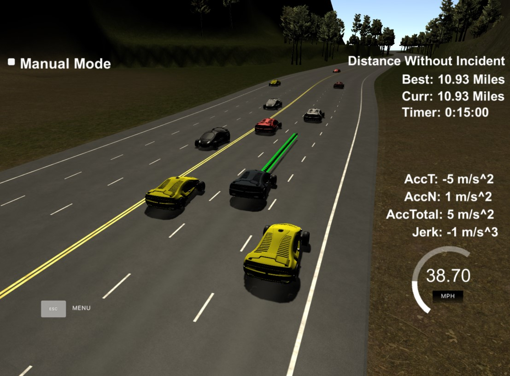

# CarND-Path-Planning-Project
Self-Driving Car Engineer Nanodegree Program



### Goals
In this project your goal is to safely navigate around a virtual highway with other traffic that is driving +-10 MPH of the 50 MPH speed limit. You will be provided the car's localization and sensor fusion data, there is also a sparse map list of waypoints around the highway. The car should try to go as close as possible to the 50 MPH speed limit, which means passing slower traffic when possible, note that other cars will try to change lanes too. The car should avoid hitting other cars at all cost as well as driving inside of the marked road lanes at all times, unless going from one lane to another. The car should be able to make one complete loop around the 6946m highway. Since the car is trying to go 50 MPH, it should take a little over 5 minutes to complete 1 loop. Also the car should not experience total acceleration over 10 m/s^2 and jerk that is greater than 10 m/s^3.

## How to use this repository and get it up and running

### Simulator.
You can download the Term3 Simulator which contains the Path Planning Project from the [releases tab (https://github.com/udacity/self-driving-car-sim/releases).

###Cloning the Repository

1. Clone this repo.
2. Make a build directory: `mkdir build && cd build` (bash)
3. Compile: `cmake .. && make`
4. Run it: `./path_planning`.

## Dependencies

* cmake >= 3.5
  * All OSes: [click here for installation instructions](https://cmake.org/install/)
* make >= 4.1
  * Linux: make is installed by default on most Linux distros
  * Mac: [install Xcode command line tools to get make](https://developer.apple.com/xcode/features/)
  * Windows: [Click here for installation instructions](http://gnuwin32.sourceforge.net/packages/make.htm)
* gcc/g++ >= 5.4
  * Linux: gcc / g++ is installed by default on most Linux distros
  * Mac: same deal as make - [install Xcode command line tools]((https://developer.apple.com/xcode/features/)
  * Windows: recommend using [MinGW](http://www.mingw.org/)
* [uWebSockets](https://github.com/uWebSockets/uWebSockets)
  * Run either `install-mac.sh` or `install-ubuntu.sh`.
  * If you install from source, checkout to commit `e94b6e1`, i.e.
    ```
    git clone https://github.com/uWebSockets/uWebSockets 
    cd uWebSockets
    git checkout e94b6e1
    ```

## Rubric

### Compilation
The code compiles correctly without any errors. I used an additional libraries as posed throughout the guide video of spline (Cubic Spline interpolation implementation).

### Valid trajectories
**The car is able to drive at least 4.32 miles without incident.**

The image above perfectly shows that my car is capable of driving even 10 miles + without any errors.

**The car drives according to the speed limit.**

The car was able to drive 10 miles + without surpassing the speed limit.

**Max Acceleration and Jerk are not Exceeded.**

The car was able to drive 10 miles + without surpassing the max acceleration and jerk.

**Car does not have collisions.**

The car was able to drive 10 miles + without a collision.

**The car stays in its lane, except for the time between changing lanes.** + **The car is able to change lanes**

The car was able to drive 10 miles + while being able to change lanes in situations where there was a slow car in front of it. In addition, the car does not spend more than 3 seconds changing lane lines.

## Reflections

The project adapts some of the concepts provided from the seed projects and coding exercises as done in the Udacity classroom setting. The use of the splines library was taken and adapted in such a way for success via the Q&A video provided. I added a lot more comments throughout main.cpp to allow for easy, simple, and straightforward understandingfor anyone when going through my code. There are 3 main steps the project follows: **Prediction, Behaviour Planning, and Trajectory Calculation.**

### Prediction

Prediction codes can be found <a href="https://github.com/srianumakonda/Become-a-Self-Driving-Car-Engineer-Term-2/blob/276c82e0bb6d987f49b56e460136d76b59b37f84/CarND-Path-Planning-Project-master/src/main.cpp#L111">here</a>. What the code is attempting to do is draw in the data from the Sensor Fusion module. Once that can successfully load, the model then iterates through teh sensor data for each car, determines its lane id (what lane it's in) and then figures out whether it is <30 meters away from our car or not. This will take us to the Behaviour Planning module to figure out what to do given an input scenario.

### Behaviour Planning

The model I used to help shape up for the Path Planning project was to use a Finite State Machine. The code for that can be found <a href="https://github.com/srianumakonda/Become-a-Self-Driving-Car-Engineer-Term-2/blob/276c82e0bb6d987f49b56e460136d76b59b37f84/CarND-Path-Planning-Project-master/src/main.cpp#L154">here</a>. This module answers the question of, "Now that I've detected a car, what do I even do?"

The finite state machine is created through the use of checking conditions (if statements). Through this, given certain situations, the car will be able to perform lane changes correctly and accurately (ex. slow car in front, time to switch lanes!). Now that we've made a decision as to where to go (ex. go left), how do we get there? Trajectory Generation answers that question.

### Trajectory Generation

Now that we've figured out where we want to go, trajectory generation will help get us there. The concept of Trajectory Generation comes from the Udacity Q&A video along with concepts from the Udacity lessons.

We can calculate the trajectories using the splines library (it fits the polynomial to help create an accurate path by mapping the sensor fusion data to find correlations from the x and y values. From there, it creates a polynomial fit of which we can input x values to get its corresponding y value). 

The Trajectory Generation is calculated <a href="https://github.com/srianumakonda/Become-a-Self-Driving-Car-Engineer-Term-2/blob/276c82e0bb6d987f49b56e460136d76b59b37f84/CarND-Path-Planning-Project-master/src/main.cpp#L178">here</a>. I use 3 points spaced out evenly of 30m, 60m, and 90m, giving distances that have the perfect length to be able to be fit into a polynomial. In order to keep a continuous trajectory, the pass_trajectory points are copied to a new trajectory. The rest of the points are calculated using the spline functions.

